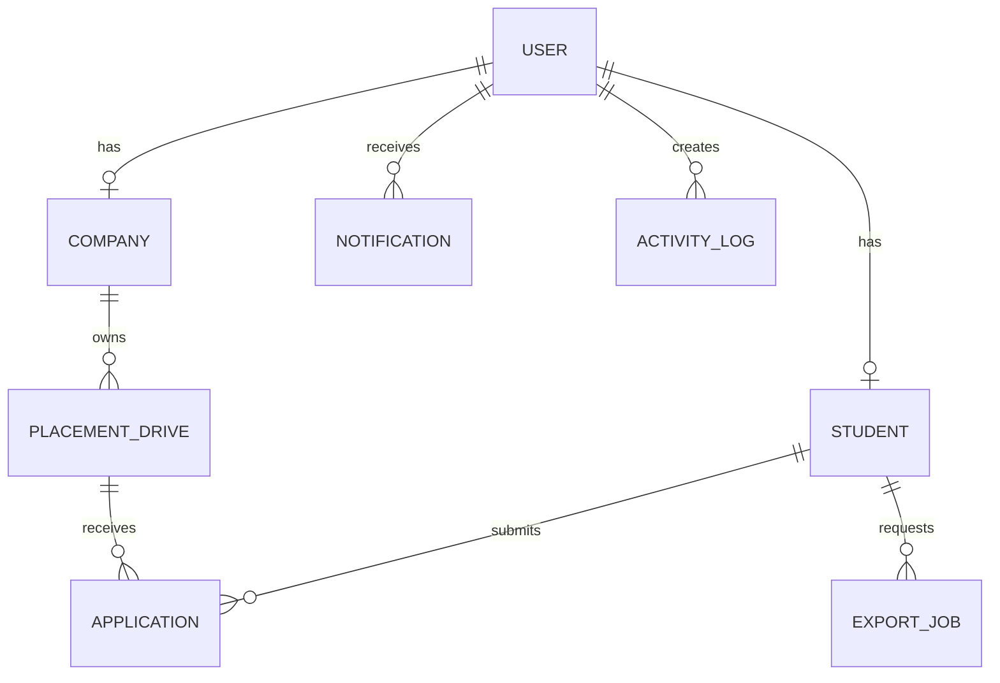

# ER Diagram

A user has one role-specific profile. Companies own drives; students and drives meet through applications. A student-drive pair is unique. Notifications and logs reference users, while export jobs reference students.

